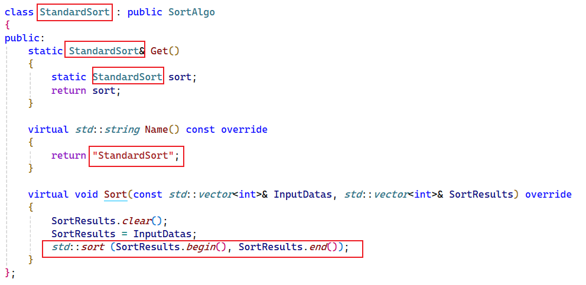
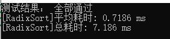

## 这是一个快速添加自定义排序算法和验证算法正确性、统计算法耗时的小框架！


**Note:**  目前仅支持int类型的升序排序验证！


**1、目前已经内置所有的经典排序算法可供参考和学习，文件头部也给了基本的注释说明！已添加的算法如下：**

- 冒泡排序【三个版本】
  - 简易小白版
  - Flag优化版
  - 循环范围优化版
- 直接插入排序
- 选择排序
- 归并排序【两个版本】
  - 递归版
  - 迭代版
- 快速排序【四个版本，三个递归+1个迭代，递归版仅选择pivot有区别】
  - 递归版，选择第一个元素作为pivot
  - 递归版，随机选择元素作为pivot
  - 递归版，Medium3方法选择pivot
  - 迭代版
- 堆排序【两个版本，仅建堆过程有区别】
  - 自顶向下建堆
  - 自底向上建堆
- 计数排序
- 基数排序


**2、快速添加自定义排序算法类的步骤：**

- 拷贝StandardSort.h文件一份，重命名文件
- 修改类名，Get函数返回值，Name()函数实现，清空原有Sort算法



- 参考main.cpp的测试调用，添加自定义算法的测试调用

```c++
SortAlgoCompareInstrumentConfig TestConfigParams; //这是测试数据的生成配置
TestConfigParams.TestTimes = 10;  //测试次数
TestConfigParams.Numbers = 10000; //样本数字个数
TestConfigParams.MinNum = 1; //最小值
TestConfigParams.MaxNum = 999; //最大值
TestConfigParams.IsPrintTime = true; //是否打印耗时
TestConfigParams.IsPrintTemp = false; //是否打印中间过程
TestConfigParams.IsPrintResult = true; //是否打印测试结果

SortAlgoCompareInstrument::Get().Execute_Test<CustomSort>(TestConfigParams); //自定义算法执行测试
```


**3、观察测试结果【默认只打印耗时和测试结果，中间过程不打印】**




